# Dataset Generation Strategy for Fine-Tuning Small Language Models

## Executive Summary

This document describes a **chunked iterative generation strategy** designed specifically for fine-tuning small language models (SLMs) with limited context windows. The approach breaks down large character descriptions into manageable chunks and uses an iterative refinement process to generate diverse, high-quality training data.

**Key Innovation**: Instead of relying on large models like GPT-4 or Claude to generate thousands of examples in one pass, this strategy uses small models (like jan-nano-128k or qwen2.5:0.5b) to generate datasets incrementally, making the process cost-effective and accessible.

---

## Problem Statement

### Challenges with Small Models

When fine-tuning small language models for NPC (Non-Player Character) generation in games, we face several challenges:

1. **Limited Context Window**: Small models typically have context windows of 8K-16K tokens, preventing them from processing large character sheets in one pass
2. **Cost Constraints**: Using large commercial models (GPT-4, Claude) for dataset generation is expensive
3. **Quality Requirements**: Need 1000+ diverse, high-quality examples for effective fine-tuning
4. **Consistency**: Must maintain character consistency across all generated examples
5. **JSON Reliability**: Small models often struggle with consistent JSON output format

---

## Solution Architecture

### High-Level Strategy

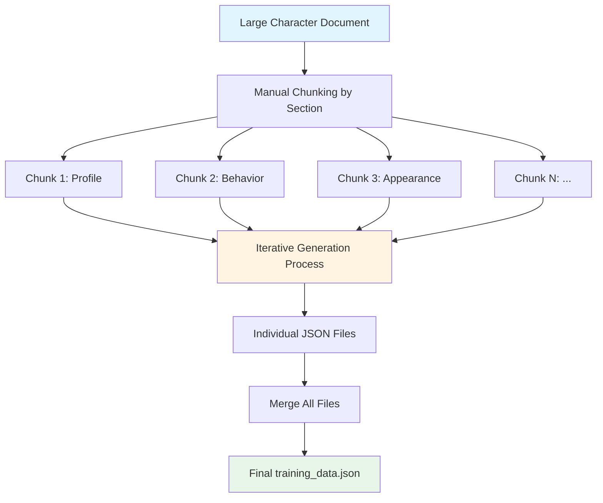

### Core Components

The system consists of three main components:

1. **Document Preparation**: Manual chunking of character sheets into focused sections
2. **Iterative Generation Engine**: Multi-pass generation with refinement
3. **Merge Pipeline**: Aggregation of all generated datasets

---

## Detailed Process Flow

### 1. Document Preparation Phase

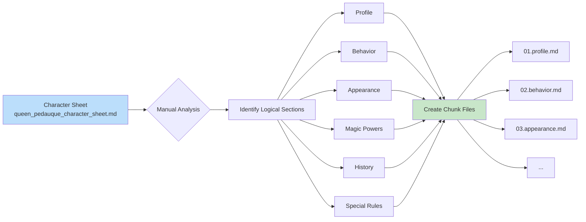

Each chunk file contains **4 sections separated by `----------` delimiter**:

1. **Context**: Brief system instructions for the character
2. **Document**: The actual content to generate examples from
3. **Settings**: JSON configuration for generation parameters
4. **Prompt Template**: Template for generating questions

**Example Chunk Structure**:
```markdown
# Queen Pédauque - Legendary Sorceress NPC System Instructions
You are Queen Pédauque, a legendary sorceress NPC...
----------
## Character Profile
- **Name**: Queen Pédauque (also known as the Goose-Footed Queen)
- **Race**: Human with Ancient Fae Heritage
...
----------
{
    "nb_dataset_entries": 20,
    "nb_iterations": 5
}
----------
From this document related to {{.NameOfTheNPC}}:
{{.Chunk}}
Generate {{.NbEntriesPerChunk}} dataset entries...
```

---

### 2. Iterative Generation Engine

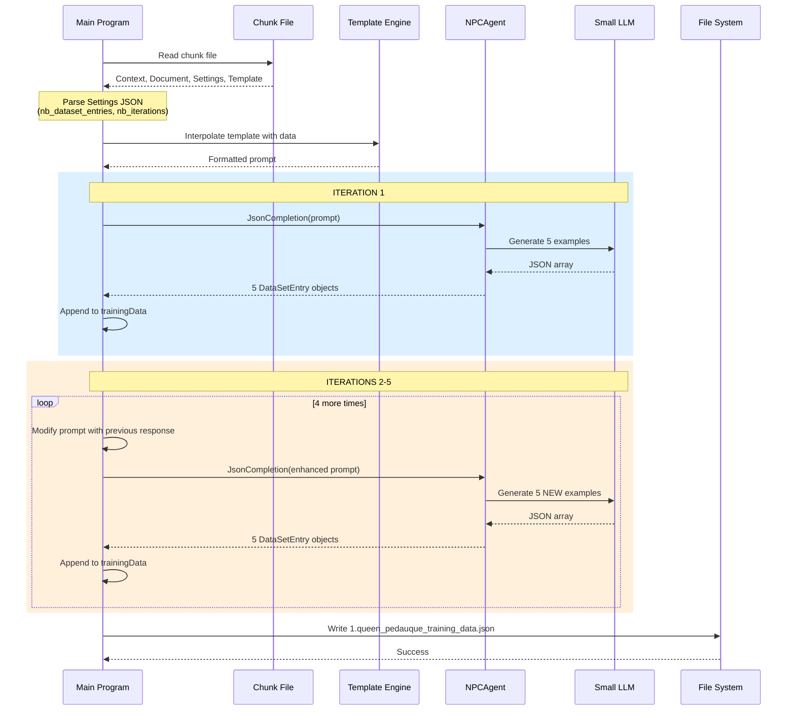

---

### 3. Generation Loop with Retry Logic

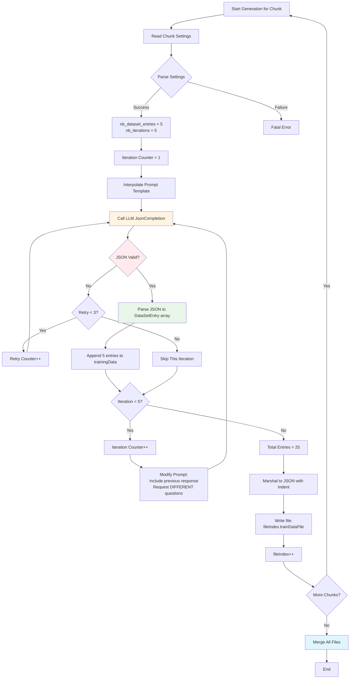

**Key Points**:
- Each chunk generates `nb_dataset_entries × nb_iterations` examples (e.g., 5 × 5 = 25)
- Each iteration explicitly asks for **DIFFERENT** questions to ensure diversity
- Retry mechanism (up to 3 attempts) handles JSON parsing failures
- Failed iterations are skipped rather than crashing the entire process

---

### 4. Iterative Refinement Strategy

The system uses a clever prompt modification technique to ensure diversity:

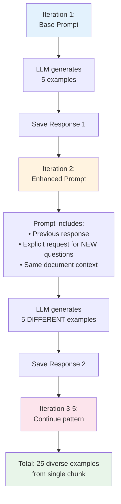

**Example Prompt Evolution**:

**Iteration 1**:
```
From this document related to Queen Pédauque:
[Document content...]
Generate 5 dataset entries...
```

**Iteration 2**:
```
Here is the previous response you gave:
[Previous JSON array...]

Now, please generate NEW more dataset entries for the same document
but with DIFFERENT prompts:
[Same document content...]
Generate 5 dataset entries...
```

This approach:
- ✅ Maintains context awareness
- ✅ Encourages diversity by showing what was already generated
- ✅ Keeps prompts focused and manageable for small models

---

## File Organization and Merging

### Individual File Generation

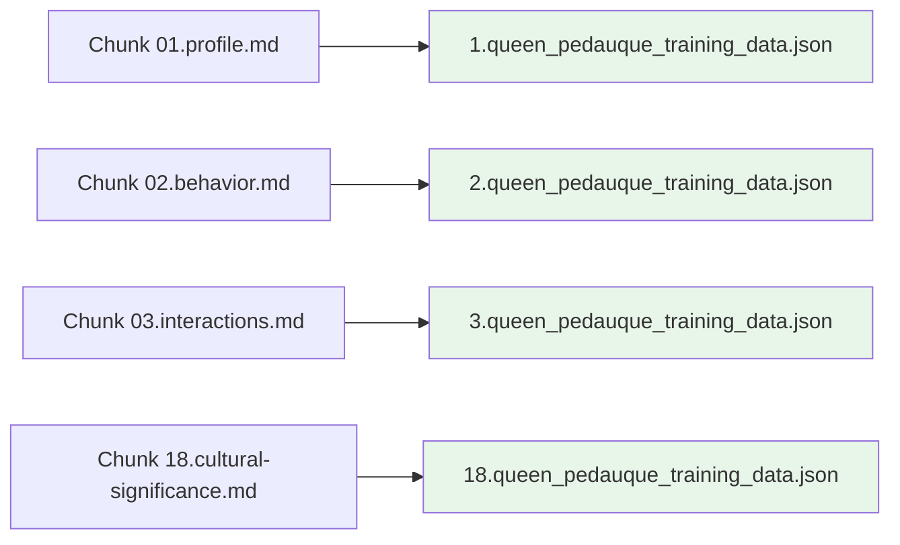

### Merge Process

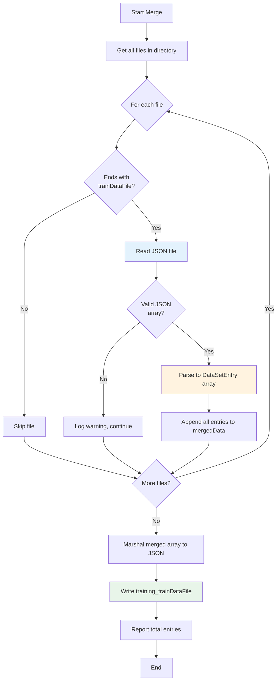

**Result**:
- Input: `1.queen_pedauque_training_data.json`, `2.queen_pedauque_training_data.json`, ... `18.queen_pedauque_training_data.json`
- Output: `training_queen_pedauque_training_data.json` (single merged file with 450+ examples)

---

## Configuration Management

### Docker Compose Configuration

The system uses Docker Compose for reproducible environments:

```yaml
environment:
  MAX_GENERATION_RETRIES: 3
  NPC_NAME: Queen Pedauque
  SYSTEM_INSTRUCTIONS: |
    You are a helpful AI assistant...
  MODEL_CONTEXT_DIRECTORY: /app/data/chunks
  TRAINING_DATA_DIRECTORY: /app/data
  TRAINING_DATA_FILE: queen_pedauque_training_data.json
  MODEL_TEMPERATURE: 1.0
  MODEL_TOP_P: 0.9

models:
  chat-model:
    model: hf.co/menlo/jan-nano-128k-gguf:q4_k_m
    context_size: 16384
```

### Parameter Tuning Guide

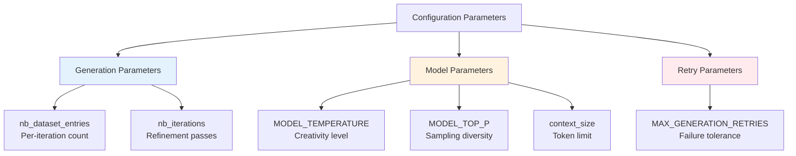

**Recommended Settings**:

| Parameter | Recommended Value | Rationale |
|-----------|------------------|-----------|
| `nb_dataset_entries` | 5 | Manageable for small models, balances quality vs quantity |
| `nb_iterations` | 5 | Provides diversity without excessive redundancy |
| `MODEL_TEMPERATURE` | 1.0 | Higher creativity for varied questions |
| `MODEL_TOP_P` | 0.9 | Balanced sampling for coherent but diverse outputs |
| `MAX_GENERATION_RETRIES` | 3 | Tolerates occasional JSON failures without infinite loops |

---

## Data Quality Assurance

### Quality Control Mechanisms

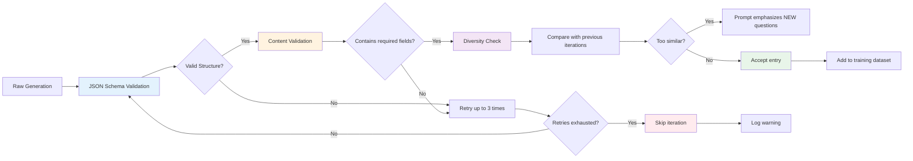

### Output Format Validation

Each generated entry must conform to:

```json
{
  "prompt": "question string (non-empty)",
  "response": "answer string (non-empty, based only on provided document)"
}
```

**Validation Rules**:
1. Must be valid JSON array
2. Each element must have exactly 2 fields: `prompt` and `response`
3. Both fields must be non-empty strings
4. Responses must be grounded in the source document (no hallucinations)
5. Prompts must be diverse across iterations

---

## Scalability and Performance

### Horizontal Scaling Strategy

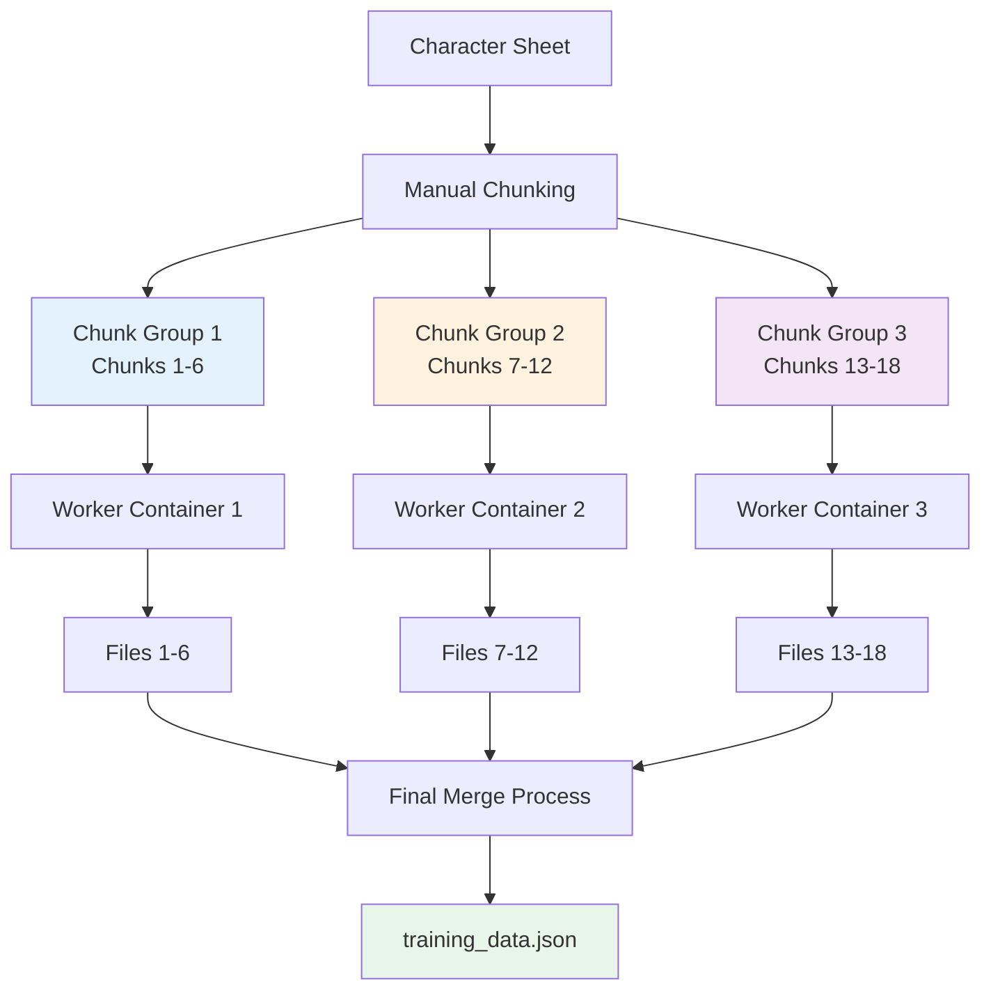

**Performance Characteristics**:
- **Sequential Processing**: One chunk at a time by default
- **Parallelization Potential**: Chunks can be processed in parallel containers
- **Time per Chunk**: ~2-5 minutes for 25 examples (depends on model speed)
- **Total Time**: 18 chunks × 3 minutes = ~54 minutes (sequential)
- **Parallel Time**: ~6 minutes with 3 workers

---

## Best Practices and Recommendations

### Chunking Strategy

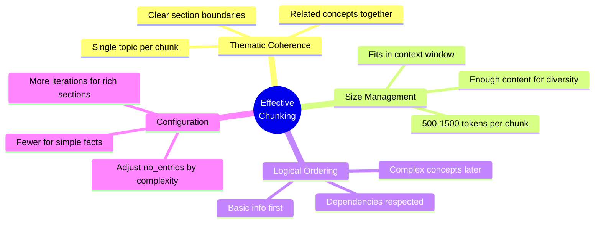

### Document Preparation Checklist

- [ ] **Identify Natural Sections**: Use existing headings and structure
- [ ] **Create Focused Chunks**: Each chunk should cover one aspect (profile, appearance, powers, etc.)
- [ ] **Include Context**: Every chunk gets the same character introduction for consistency
- [ ] **Configure Settings**: Adjust `nb_dataset_entries` and `nb_iterations` based on section richness
- [ ] **Write Clear Prompts**: Templates should guide the model to generate specific question types

### Example Chunking Decision Tree

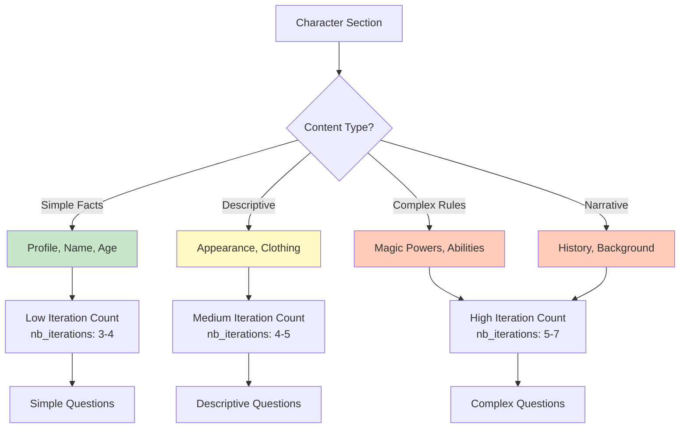

---

## Troubleshooting Guide

### Common Issues and Solutions

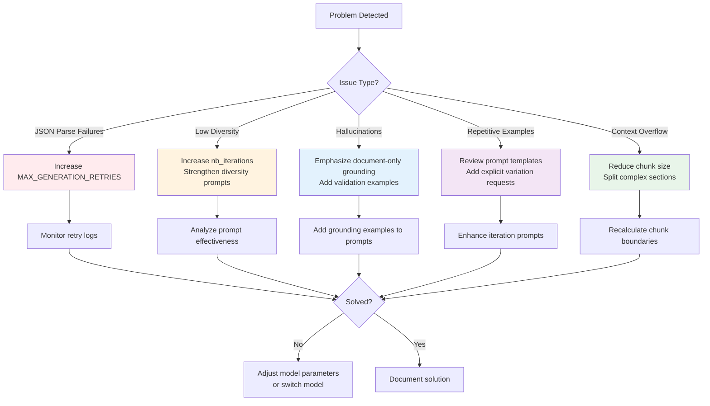

### Debugging Workflow

1. **Check Logs**: Monitor console output for retry attempts and failures
2. **Inspect Partial Outputs**: Review individual chunk files for quality
3. **Validate JSON Structure**: Use JSON validators on generated files
4. **Review Prompt Templates**: Ensure templates are clear and unambiguous
5. **Test with Single Chunk**: Isolate problematic chunks for focused debugging

---

## Success Metrics

### Quality Indicators

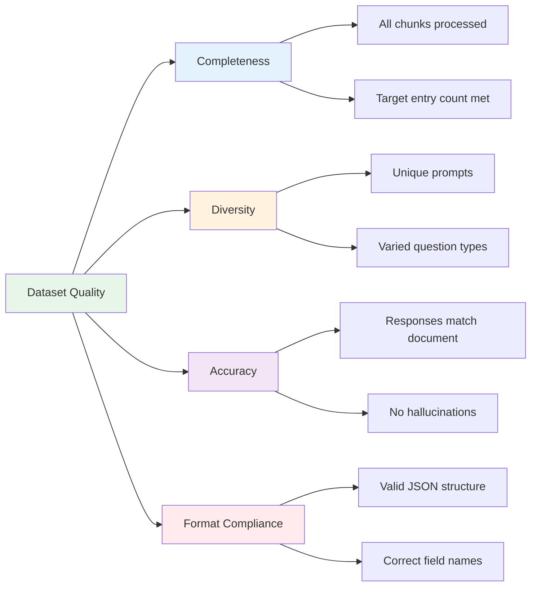

**Target Metrics**:
- **Total Examples**: 1000+ entries
- **Chunk Coverage**: 100% of character aspects
- **JSON Validity**: >95% on first attempt
- **Diversity Score**: <10% duplicate prompts
- **Accuracy**: 100% responses grounded in source document

---

## Conclusion

This chunked iterative generation strategy enables **cost-effective, high-quality dataset creation using small language models**. By breaking down complex character descriptions, iterating for diversity, and maintaining strict quality controls, the system produces training data suitable for fine-tuning NPC models.

**Key Advantages**:
- ✅ Works with small, resource-efficient models
- ✅ Produces diverse, high-quality examples
- ✅ Handles JSON generation failures gracefully
- ✅ Scales horizontally for faster processing
- ✅ Maintains character consistency across all examples

**Ideal Use Cases**:
- Fine-tuning small models for game NPCs
- Creating character-specific chatbots
- Training models with limited GPU resources
- Educational projects for learning LLM fine-tuning
- Cost-sensitive production environments
