# Stratégie de Génération de Données pour le Fine-Tuning de Petits Modèles de Langage

## Résumé Exécutif

Ce document décrit une **stratégie de génération itérative par fragments** conçue spécifiquement pour le fine-tuning de petits modèles de langage (SLM) avec des fenêtres de contexte limitées. L'approche divise les grandes descriptions de personnages en fragments gérables et utilise un processus de raffinement itératif pour générer des données d'entraînement diversifiées et de haute qualité.

**Innovation Clé** : Au lieu de s'appuyer sur de grands modèles comme GPT-4 ou Claude pour générer des milliers d'exemples en une seule passe, cette stratégie utilise de petits modèles (comme jan-nano-128k ou qwen2.5:0.5b) pour générer des datasets de manière incrémentale, rendant le processus économique et accessible.

---

## Énoncé du Problème

### Défis avec les Petits Modèles

Lors du fine-tuning de petits modèles de langage pour la génération de PNJ (Personnages Non-Joueurs) dans les jeux, nous faisons face à plusieurs défis :

1. **Fenêtre de Contexte Limitée** : Les petits modèles ont généralement des fenêtres de contexte de 8K-16K tokens, les empêchant de traiter de grandes fiches de personnages en une seule passe
2. **Contraintes de Coût** : Utiliser de grands modèles commerciaux (GPT-4, Claude) pour la génération de datasets est coûteux
3. **Exigences de Qualité** : Besoin de 1000+ exemples diversifiés et de haute qualité pour un fine-tuning efficace
4. **Cohérence** : Doit maintenir la cohérence du personnage à travers tous les exemples générés
5. **Fiabilité JSON** : Les petits modèles ont souvent du mal avec un format de sortie JSON cohérent

---

## Architecture de la Solution

### Stratégie de Haut Niveau

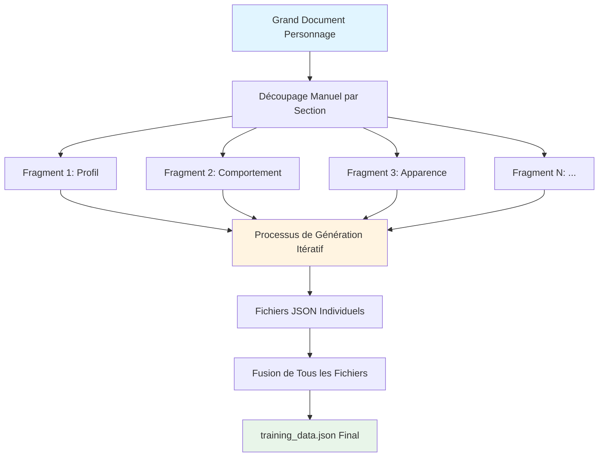

### Composants Principaux

Le système se compose de trois composants principaux :

1. **Préparation du Document** : Découpage manuel des fiches de personnage en sections ciblées
2. **Moteur de Génération Itérative** : Génération multi-passes avec raffinement
3. **Pipeline de Fusion** : Agrégation de tous les datasets générés

---

## Flux de Processus Détaillé

### 1. Phase de Préparation du Document

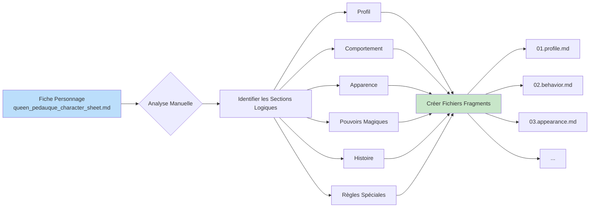

Chaque fichier fragment contient **4 sections séparées par le délimiteur `----------`** :

1. **Contexte** : Instructions système brèves pour le personnage
2. **Document** : Le contenu réel à partir duquel générer des exemples
3. **Paramètres** : Configuration JSON pour les paramètres de génération
4. **Template de Prompt** : Modèle pour générer les questions

**Exemple de Structure de Fragment** :
```markdown
# Queen Pédauque - Instructions Système PNJ Sorcière Légendaire
Vous êtes Queen Pédauque, une sorcière légendaire PNJ...
----------
## Profil du Personnage
- **Nom** : Queen Pédauque (aussi connue comme la Reine aux Pieds d'Oie)
- **Race** : Humaine avec Héritage Féérique Ancien
...
----------
{
    "nb_dataset_entries": 20,
    "nb_iterations": 5
}
----------
À partir de ce document lié à {{.NameOfTheNPC}} :
{{.Chunk}}
Générer {{.NbEntriesPerChunk}} entrées de dataset...
```

---

### 2. Moteur de Génération Itérative

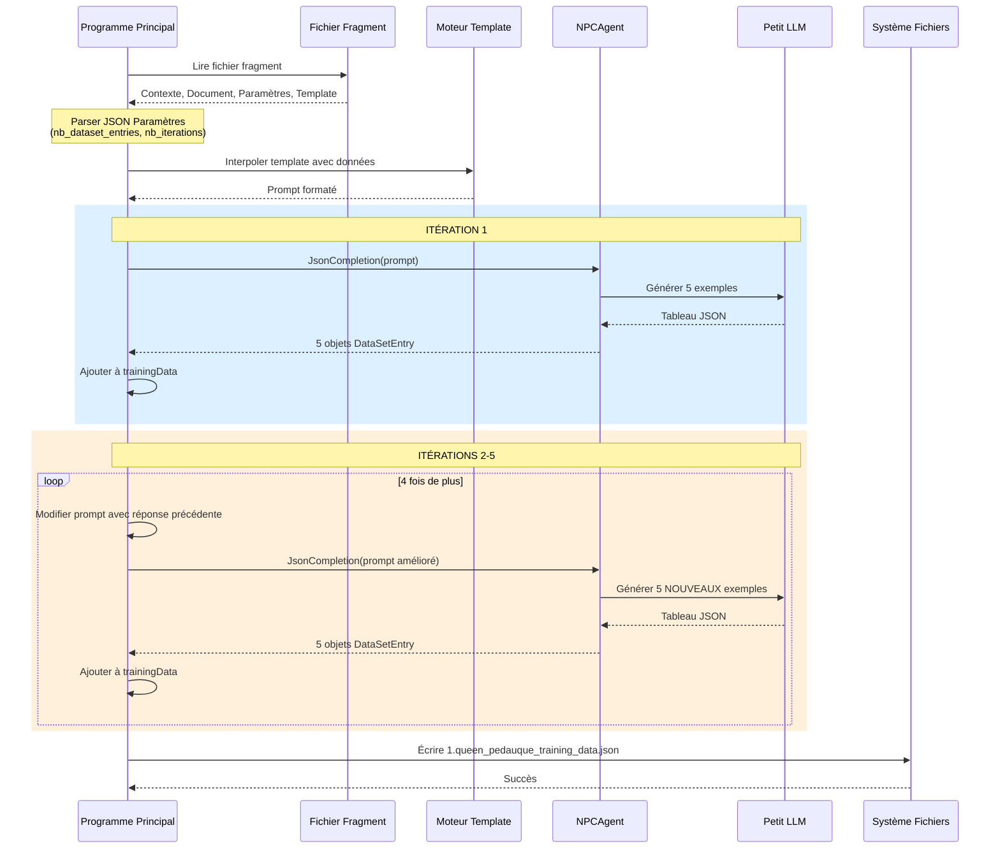

---

### 3. Boucle de Génération avec Logique de Retry

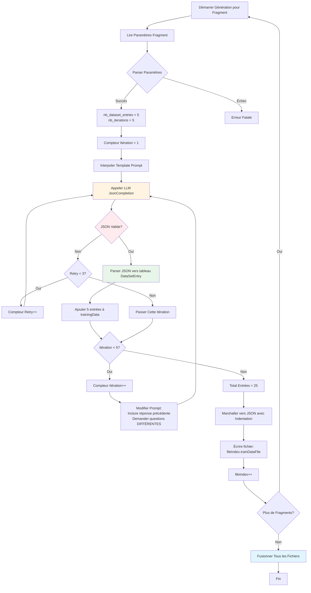

**Points Clés** :
- Chaque fragment génère `nb_dataset_entries × nb_iterations` exemples (ex: 5 × 5 = 25)
- Chaque itération demande explicitement des questions **DIFFÉRENTES** pour assurer la diversité
- Mécanisme de retry (jusqu'à 3 tentatives) gère les échecs de parsing JSON
- Les itérations échouées sont sautées plutôt que de crasher tout le processus

---

### 4. Stratégie de Raffinement Itératif

Le système utilise une technique astucieuse de modification de prompt pour assurer la diversité :

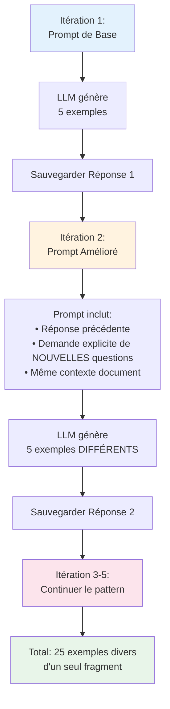

**Exemple d'Évolution de Prompt** :

**Itération 1** :
```
À partir de ce document lié à Queen Pédauque :
[Contenu document...]
Générer 5 entrées de dataset...
```

**Itération 2** :
```
Voici la réponse précédente que vous avez donnée :
[Tableau JSON précédent...]

Maintenant, veuillez générer de NOUVELLES entrées de dataset pour le même document
mais avec des prompts DIFFÉRENTS :
[Même contenu document...]
Générer 5 entrées de dataset...
```

Cette approche :
- ✅ Maintient la conscience du contexte
- ✅ Encourage la diversité en montrant ce qui a déjà été généré
- ✅ Garde les prompts ciblés et gérables pour les petits modèles

---

## Organisation des Fichiers et Fusion

### Génération de Fichiers Individuels

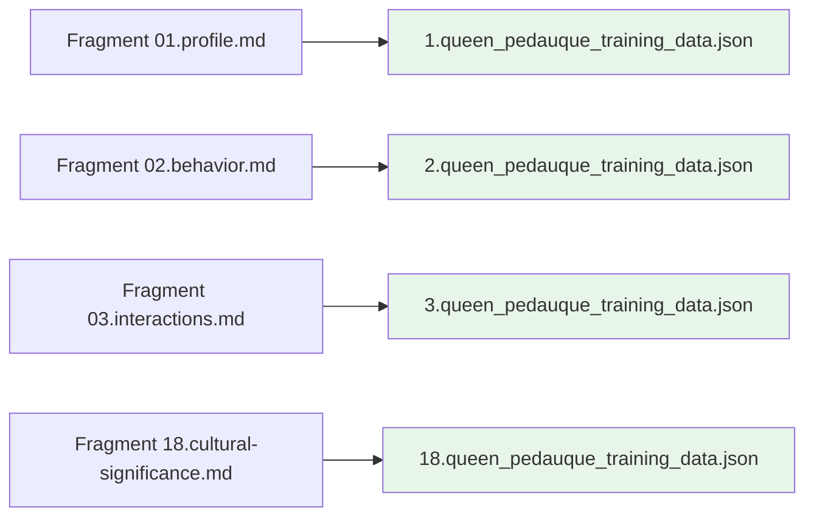

### Processus de Fusion

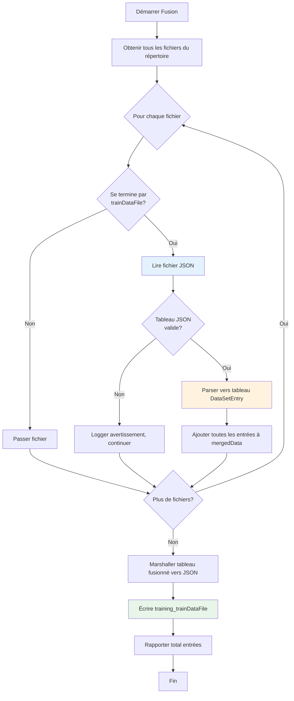

**Résultat** :
- Entrée : `1.queen_pedauque_training_data.json`, `2.queen_pedauque_training_data.json`, ... `18.queen_pedauque_training_data.json`
- Sortie : `training_queen_pedauque_training_data.json` (fichier unique fusionné avec 450+ exemples)

---

## Gestion de la Configuration

### Configuration Docker Compose

Le système utilise Docker Compose pour des environnements reproductibles :

```yaml
environment:
  MAX_GENERATION_RETRIES: 3
  NPC_NAME: Queen Pedauque
  SYSTEM_INSTRUCTIONS: |
    Vous êtes un assistant IA utile...
  MODEL_CONTEXT_DIRECTORY: /app/data/chunks
  TRAINING_DATA_DIRECTORY: /app/data
  TRAINING_DATA_FILE: queen_pedauque_training_data.json
  MODEL_TEMPERATURE: 1.0
  MODEL_TOP_P: 0.9

models:
  chat-model:
    model: hf.co/menlo/jan-nano-128k-gguf:q4_k_m
    context_size: 16384
```

### Guide d'Ajustement des Paramètres

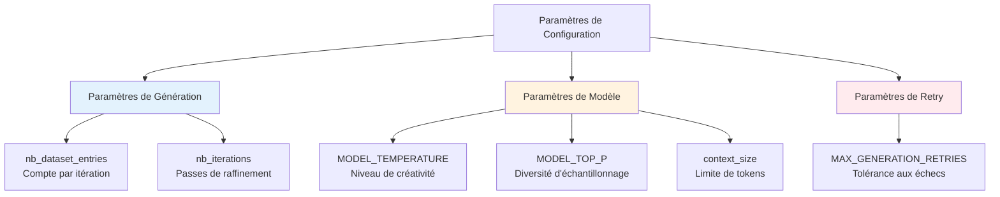

**Paramètres Recommandés** :

| Paramètre | Valeur Recommandée | Justification |
|-----------|-------------------|---------------|
| `nb_dataset_entries` | 5 | Gérable pour petits modèles, équilibre qualité vs quantité |
| `nb_iterations` | 5 | Fournit diversité sans redondance excessive |
| `MODEL_TEMPERATURE` | 1.0 | Créativité élevée pour questions variées |
| `MODEL_TOP_P` | 0.9 | Échantillonnage équilibré pour sorties cohérentes mais diverses |
| `MAX_GENERATION_RETRIES` | 3 | Tolère échecs JSON occasionnels sans boucles infinies |

---

## Assurance Qualité des Données

### Mécanismes de Contrôle Qualité

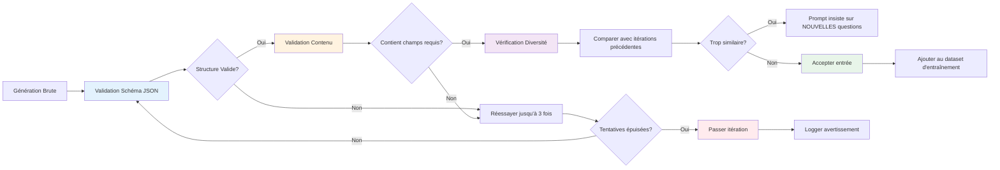

### Validation du Format de Sortie

Chaque entrée générée doit se conformer à :

```json
{
  "prompt": "chaîne question (non vide)",
  "response": "chaîne réponse (non vide, basée uniquement sur document fourni)"
}
```

**Règles de Validation** :
1. Doit être un tableau JSON valide
2. Chaque élément doit avoir exactement 2 champs : `prompt` et `response`
3. Les deux champs doivent être des chaînes non vides
4. Les réponses doivent être ancrées dans le document source (pas d'hallucinations)
5. Les prompts doivent être diversifiés à travers les itérations

---

## Scalabilité et Performance

### Stratégie de Scaling Horizontal

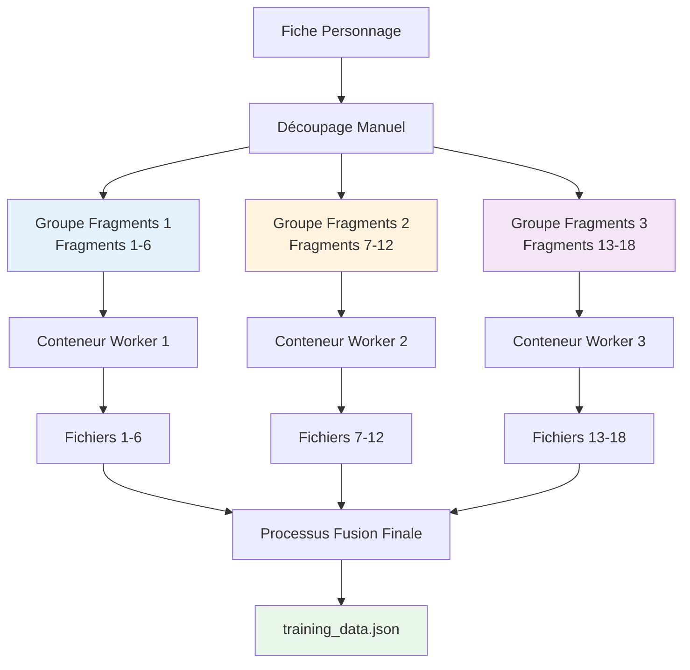

**Caractéristiques de Performance** :
- **Traitement Séquentiel** : Un fragment à la fois par défaut
- **Potentiel de Parallélisation** : Les fragments peuvent être traités en conteneurs parallèles
- **Temps par Fragment** : ~2-5 minutes pour 25 exemples (dépend de la vitesse du modèle)
- **Temps Total** : 18 fragments × 3 minutes = ~54 minutes (séquentiel)
- **Temps Parallèle** : ~6 minutes avec 3 workers

---

## Meilleures Pratiques et Recommandations

### Stratégie de Découpage

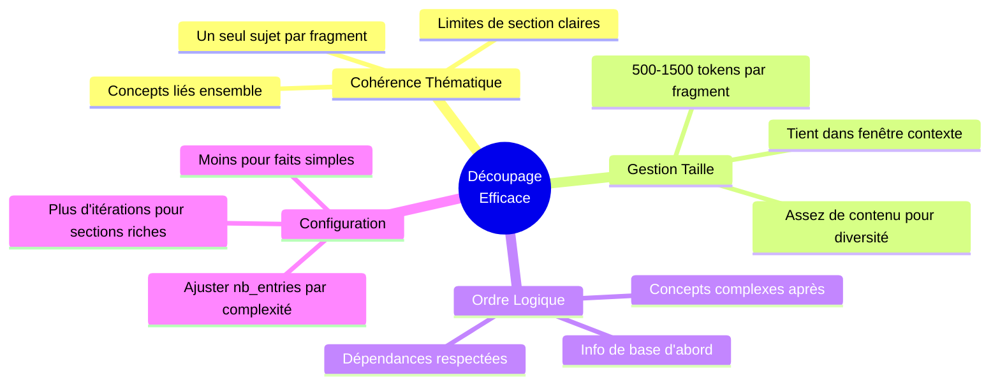

### Checklist Préparation Document

- [ ] **Identifier Sections Naturelles** : Utiliser en-têtes et structure existants
- [ ] **Créer Fragments Ciblés** : Chaque fragment devrait couvrir un aspect (profil, apparence, pouvoirs, etc.)
- [ ] **Inclure Contexte** : Chaque fragment reçoit la même introduction de personnage pour cohérence
- [ ] **Configurer Paramètres** : Ajuster `nb_dataset_entries` et `nb_iterations` selon richesse section
- [ ] **Écrire Prompts Clairs** : Les templates devraient guider le modèle à générer types de questions spécifiques

### Arbre de Décision de Découpage

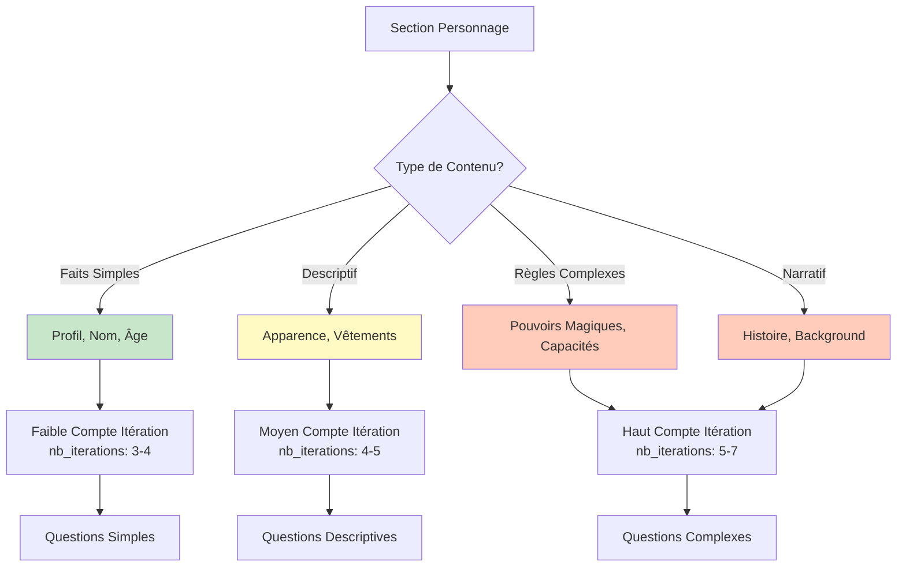

---

## Guide de Dépannage

### Problèmes Courants et Solutions

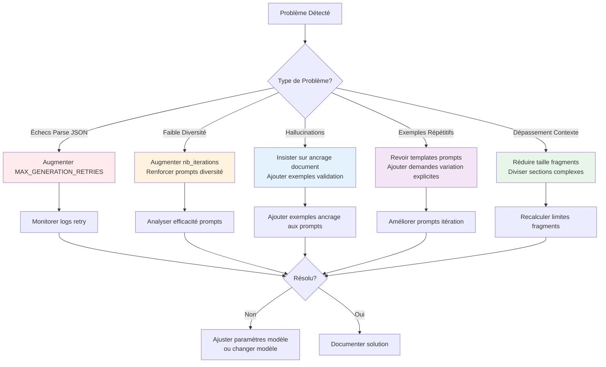

### Workflow de Débogage

1. **Vérifier Logs** : Monitorer sortie console pour tentatives retry et échecs
2. **Inspecter Sorties Partielles** : Revoir fichiers fragments individuels pour qualité
3. **Valider Structure JSON** : Utiliser validateurs JSON sur fichiers générés
4. **Revoir Templates Prompts** : S'assurer que les templates sont clairs et non ambigus
5. **Tester avec Fragment Unique** : Isoler fragments problématiques pour débogage ciblé

---

## Métriques de Succès

### Indicateurs de Qualité

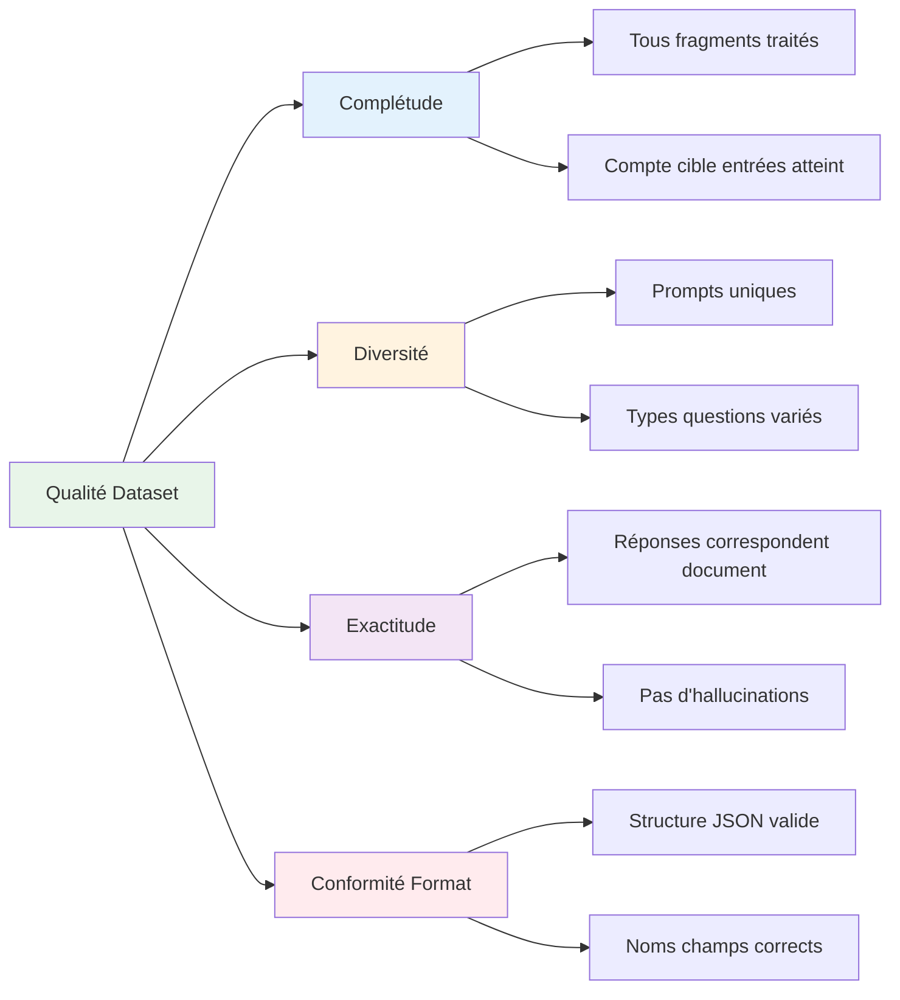

**Métriques Cibles** :
- **Total Exemples** : 1000+ entrées
- **Couverture Fragments** : 100% des aspects personnage
- **Validité JSON** : >95% à la première tentative
- **Score Diversité** : <10% de prompts dupliqués
- **Exactitude** : 100% réponses ancrées dans document source

---

## Conclusion

Cette stratégie de génération itérative par fragments permet la **création de datasets économique et de haute qualité en utilisant de petits modèles de langage**. En décomposant les descriptions de personnages complexes, en itérant pour la diversité, et en maintenant des contrôles qualité stricts, le système produit des données d'entraînement adaptées au fine-tuning de modèles PNJ.

**Avantages Clés** :
- ✅ Fonctionne avec des modèles petits et économes en ressources
- ✅ Produit des exemples diversifiés et de haute qualité
- ✅ Gère les échecs de génération JSON avec élégance
- ✅ Scale horizontalement pour traitement plus rapide
- ✅ Maintient cohérence personnage à travers tous les exemples

**Cas d'Usage Idéaux** :
- Fine-tuning de petits modèles pour PNJ de jeux
- Création de chatbots spécifiques à un personnage
- Entraînement de modèles avec ressources GPU limitées
- Projets éducatifs pour apprendre le fine-tuning LLM
- Environnements de production sensibles aux coûts
