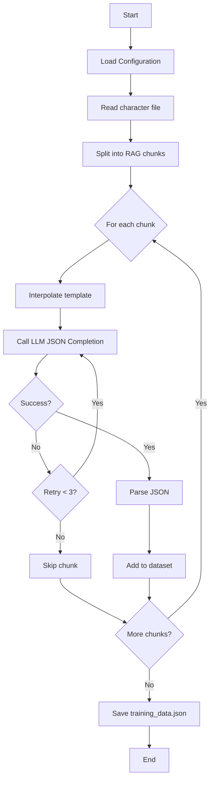
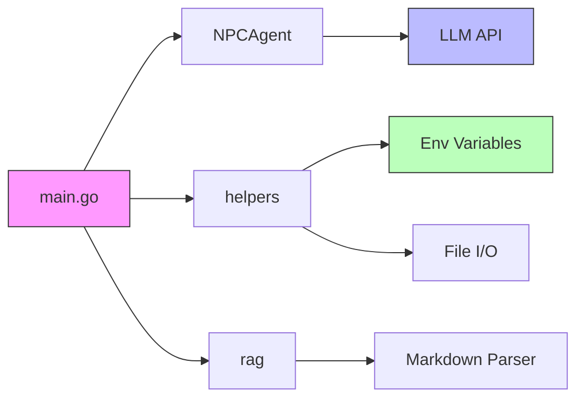
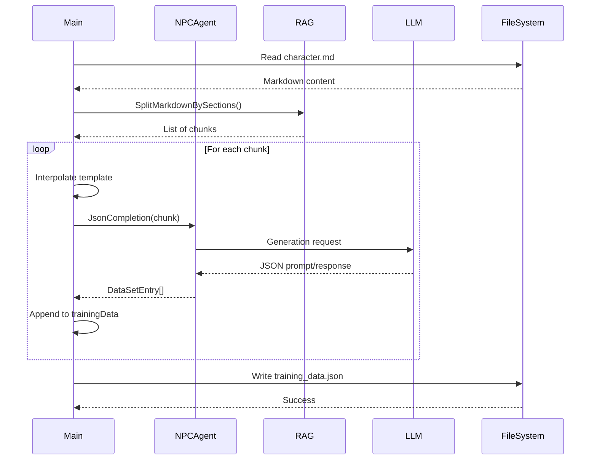

# Generate dataset for NPC agents to fine-tune language models

## Description

This program automatically generates training datasets for Language Models (LLMs) to create Non-Player Characters (NPCs) with consistent personalities in a role-playing game.

### How it works

The program analyzes a document describing an NPC's background and personality, splits it into logical sections, then uses an LLM to generate prompt/response pairs that capture the character's essence. This data can then be used to fine-tune a language model specific to the character.

### Main steps

1. **Configuration**: Loads parameters from environment variables (model URL, temperature, etc.)
2. **Context loading**: Reads the markdown file containing the character description
3. **RAG splitting**: Divides the document into chunks by sections for optimal processing
4. **Generation**: For each chunk, asks the LLM to generate N prompt/response pairs
5. **Validation**: Retries up to 3 times in case of JSON parsing failure
6. **Save**: Exports all entries to a training JSON file

### Environment variables

- `MODEL_RUNNER_BASE_URL`: LLM engine API URL
- `CHAT_MODEL`: Model identifier to use
- `MODEL_TEMPERATURE`: Model temperature (creativity)
- `MODEL_TOP_P`: Top-P sampling
- `SYSTEM_INSTRUCTIONS`: System instructions for the agent
- `CONTEXT_PATH`: Path to the character description file
- `DATASET_ENTRIES_PER_CHUNK`: Number of entries to generate per chunk
- `NPC_NAME`: Character name
- `TEMPLATE`: Template for prompt generation

## Architecture diagrams

### Process overview

### Component architecture

### Data flow

